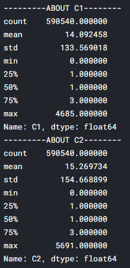
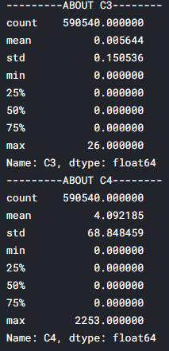
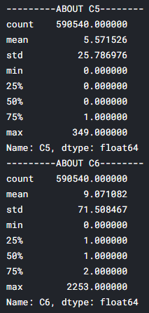
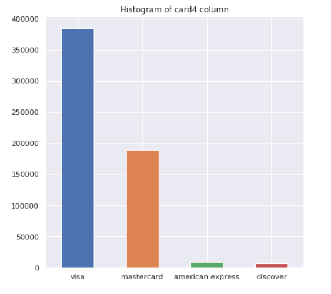
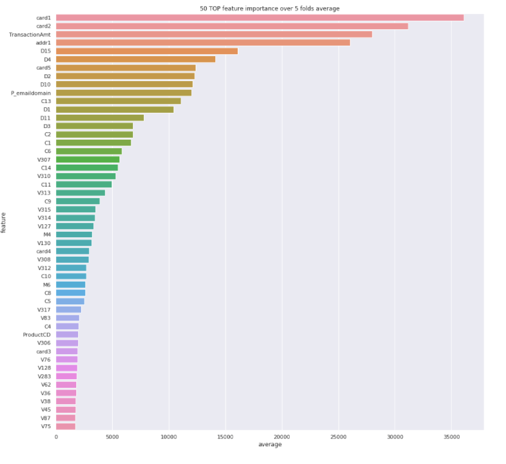

## Abstract

[IEEE-CIS Fraud Detection competition](https://www.kaggle.com/c/ieee-fraud-detection) on Kaggle is binary classification problem where we have to generate the probability of fraudulent transaction. Necessary preprocessing like dropping, merging, label encoding etc. are done on train and test dataset. Then, EDA is done on train dataset. Finally, LightGBM model is trained using the train dataset which gives an accuracy of 0.936113 i.e. 93.6% on test dataset.

## Methodology

Both train dataset and test dataset is divided into two parts. First, I merged them using left join with respect to TransactionID feature. Then, I performed exploratory data analysis to understand train dataset. Most of the columns were missing values. So, I dropped columns which had more than 50% missing data. I performed label encoding on categorical features. I plotted the feature distributions and also printed necessary statistical inference of features in console to visualize the train dataset.

Initially, train dataset had around 434 columns/features. After preprocessing, I was left with 217 features which I used for training. This report would end up being very lengthy if I try to explain all 217 features and its distribution. I am going to provide just 2 examples of EDA performed in my project. 

##### Statistical Data of C1, C2, C3, C4, C5, C6 Features

##### Hsitogram of card4 Feature Distribution

C1-C6 features wasn’t plotted as it needed normalization. Instead, I could get insights of C1-C6 by just printing the statistical data. 

## Result Analysis

I used LightGBM model for generating the probability as it is faster than most other classification model such as XGBoost, K-neighbour’s, Random Forest, Decision Trees etc. Another advantage of LightGBM is that, it can tolerate null values in train dataset. LightGBM is similar to XGBoost as both uses gradient boosting and they generate prediction based on several ‘weak learner’s’ such as, decision trees. The main difference between LightGBM and XGBoost is, LightGBM makes decision trees depth wise (like DFS algorithm) whereas XGBoost makes decision trees breadth wise (like BFS algorithm).

The evaluation metric used is ‘AUC’ i.e. calculating area under curve of ROC graph which is generated from confusion matrix. I have used 217 features to train the LightGBM model and plotted top 50 important features according to my model which is given below:

##### 50 Most Important Feature

## Conclusion

Even though my model’s accuracy is 0.936113, it can be improved by more sophisticated
feature selection process like ‘Recursive Feature Selection’ and feature engineering. I also intend to implement other classification model like XGBoost, Logistic Regressor, K-neighbour’s model on this dataset and compare the accuracy.

